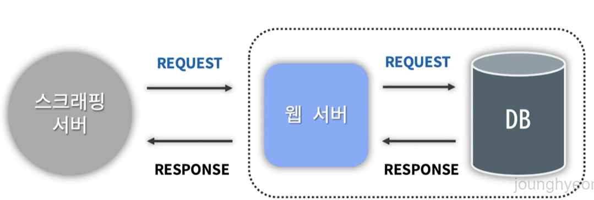

# 사용한 개념
1. 스크래핑
  - HTML 문서를 받은 후
  - 문서를 파싱 해서
  - 필요한 데이터를 추출
    
> 단, 저작권 문제로 함부로 스크래핑 하면 안됨 + 서버 부하

*그럼 어떤 데이터가 스크래핑 하면 안되는 걸까?*
- 보통 robots.txt 문서에 정의되어 있다.
- 확인하고자 하는 페이지의 `루트 경로 URL` 뒤에 `robots.txt`를 입력한 후 Enter치면 확인 가능
- Disallow로 시작하는 문서가 스크래핑 불가 데이터이다.
> 회사에서는 하나의 서비스가 아닌 여러 서비스를 가지고 프로젝트를 진행하기 때문에 내가 개발 서비스가 어디에서 호출되는지 아는 것이 중요하다.
---
# 기능(API)
1. 배당금 조회
2. 배당금 검색 - 자동완성
3. 회사 리스트 조회
4. 관리자 기능 - 배당금 저장
5. 관리자 기능 - 배당금 삭제
6. 회원 : 회원가입, 로그인, 로그아웃 => 회원 인증 
---
# 오류
1. Jsoup의 기본 User-Agent
- 개념
Jsoup에는 기본으로 설정된 User-Agent가 있다. 
- 상황
일부 서버에서는 이 User-Agent를 봇으로 감지해 접근을 차단하게 된다.
503 Error가 뜨길래 처음에는 데이터를 너무 많이 가져와서 서버 과부하가 발생했나? 아니면 ip문제인가 싶었지만 모두 아니었다.
- 해결 
해결하기 위해 웹 스크래핑 요청을 보낼 때 봇이 아닌 일반 사용자의 브라우저에서 보내는 요청처럼 보이게하기 위해 별도의
User-Agent를 설정했다.
---
# 신경쓴 코드(?)
1. valueOf vs parseInt
- 클래스 : DividendManageProjectApplication
- 코드 : int day = Integer.parseInt(splits[1].replace(",", ""));
- 내용 : valueOf는 Integer를 반환하고 parseInt는 int를 반환한다. 메모리 사용에있어 객체를 생성하지 않는 parseInt가 더 효율적이라고 판단. (아직 자세히는 모르겠음)
---
# CodeTelling
## 스크래핑
내가 원하는 사이트를 `http connection`을 맺고 이 커넥션으로부터 html 문서를 받아서 parsing된 형태로 `Document 인스턴스 형태`로
만들어주는 걸 `Jsoup 라이브러리`가 해준다. 이후 필요한 데이터를 찾아 알맞은 코드를 사용해 기능을 구현

---
# 참조 사이트 
1. [Jsoup](   https://jsoup.org/apidocs/org/jsoup/Jsoup.html
   ). : HTML 파싱, 조작 그리고 데이터 추출을 위한 라이브러리
```java
// 기본형태 
Connection connection = Jsoup.connect(" ");
Document document = connection.get();
``` 
