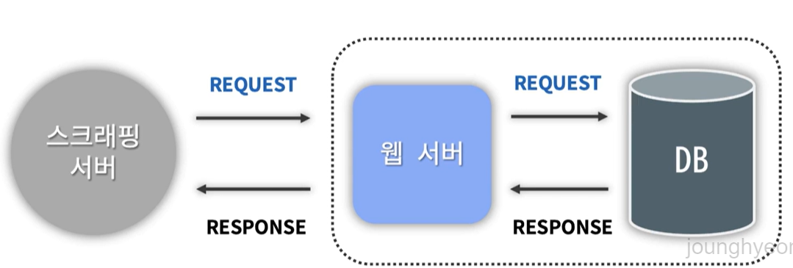

# 사용한 개념
1. 스크래핑
- HTML 문서를 받은 후
- 문서를 파싱 해서
- 필요한 데이터를 추출
  
> 단, 저작권 문제로 함부로 스크래핑 하면 안됨 + 서버 부하

*그럼 어떤 데이터가 스크래핑 하면 안되는 걸까?*
- 보통 robots.txt 문서에 정의되어 있다.
- 확인하고자 하는 페이지의 `루트 경로 URL` 뒤에 `robots.txt`를 입력한 후 Enter치면 확인 가능
- Disallow로 시작하는 문서가 스크래핑 불가 데이터이다.
> 회사에서는 하나의 서비스가 아닌 여러 서비스를 가지고 프로젝트를 진행하기 때문에 내가 개발 서비스가 어디에서 호출되는지 아는 것이 중요하다.
---
# 기능(API)
1. 배당금 조회
2. 배당금 검색 - 자동완성
3. 회사 리스트 조회
4. 관리자 기능 - 배당금 저장
5. 관리자 기능 - 배당금 삭제
6. 회원 : 회원가입, 로그인, 로그아웃 => 회원 인증
---
# 오류
1. Jsoup의 기본 User-Agent
- 개념
  : Jsoup에는 기본으로 설정된 User-Agent가 있다.

- 상황
  : 일부 서버에서는 이 User-Agent를 봇으로 감지해 접근을 차단하게 된다.
  503 Error가 뜨길래 처음에는 데이터를 너무 많이 가져와서 서버 과부하가 발생했나? 아니면 ip문제인가 싶었지만 모두 아니었다.

- 해결
  : 해결하기 위해 웹 스크래핑 요청을 보낼 때 봇이 아닌 일반 사용자의 브라우저에서 보내는 요청처럼 보이게하기 위해 별도의
  User-Agent를 설정했다.

2. 소켓 타임아웃 오류
- 개념
  : 네트워크 연결이 너무 오래 걸리거나 응답이 없는 경우 타임아웃 오류가 발생한다.

- 상황
  : YahooFinanceScrapper 클래스에서 데이터를 스크래핑할 때 소켓 타임아웃이 발생함

- 해결
  : Jsoup 라이브러리를 사용한 코드엣 `.timeout(50000)`코드를 추가함

> Jsoup의 기본 응답시간은 3초라고 해서 5초로 설정한건데 나중에 1초로 설정했는데도 돌아감.. 왜그러지?

> 가끔, 5초로 설정했을 때도 timeout error가 뜬다. 알아보니까 로컬 네트워크 상황에따라 그럴수 있다고하는데 이게 맞는걸까?

---
# 새로 배운 개념
1. valueOf vs parseInt
- 클래스 : DividendManageProjectApplication
- 코드 : int day = Integer.parseInt(splits[1].replace(",", ""));
- 내용 : valueOf는 Integer를 반환하고 parseInt는 int를 반환한다. 메모리 사용에있어 객체를 생성하지 않는 parseInt가 더 효율적이라고 판단. (아직 자세히는 모르겠음)

2. Thread.currentThread().interrupt(); vs throw new RuntimeException
```markdown
e.printStackTrace(); Thread.currentThread().interrupt();
이 코드는 예외 발생 시 스레드를 적절하게 처리하면서, 예외의 상세한 정보를 출력하고 현재 스레드의 상태를 관리합니다.

e.printStackTrace();:

예외가 발생했을 때, 예외 객체 e의 스택 트레이스를 콘솔에 출력합니다.
스택 트레이스는 예외가 발생한 지점까지의 메소드 호출 경로를 보여주며, 디버깅 시 유용한 정보를 제공합니다.
Thread.currentThread().interrupt();:

현재 실행 중인 스레드에 대해 인터럽트 상태를 설정합니다.
InterruptedException이 발생하면 스레드의 인터럽트 상태가 클리어(clear)되므로, Thread.currentThread().interrupt();를 호출하여 스레드가 여전히 인터럽트 상태임을 표시합니다.
이 코드를 통해, 상위 호출자에게 스레드가 중단(interrupt)되었음을 알리는 것이 좋습니다. 예를 들어, 향후 스레드의 상태를 체크하거나 다른 처리에서 이 인터럽트 상태를 활용할 수 있습니다.
이 패턴은 예외를 처리하되, 스레드를 올바르게 정리하고 인터럽트 상태를 복구하는 데 유용합니다. 다만, 예외를 던지지 않기 때문에 상위 메소드로 예외가 전파되지는 않습니다.

throw new RuntimeException(e);
이 코드는 발생한 예외를 RuntimeException으로 래핑(wrap)하여 다시 던지는 것입니다.

예외 전파:

예외 e를 RuntimeException으로 감싸서 상위 호출 메소드로 전파합니다. 이로 인해, 예외가 잡히지 않는 한 프로그램이 비정상적으로 종료될 수 있습니다.
RuntimeException은 체크 예외(checked exception)가 아닌 언체크 예외(unchecked exception)로, 호출 메소드에서 명시적으로 처리할 필요는 없지만, 예외가 발생하면 프로그램의 흐름에 큰 영향을 미칩니다.
런타임 예외로 변환:

예외를 런타임 예외로 변환하여 던지면, 예외를 명시적으로 처리하지 않은 코드에서도 해당 예외에 대한 반응을 강제할 수 있습니다.
이 패턴은 예외를 무시하지 않고 상위로 전파시켜, 호출 스택 상위에서 적절하게 처리하거나 프로그램을 종료하도록 하는 데 유용합니다.

요약
e.printStackTrace(); Thread.currentThread().interrupt();: 예외 정보를 출력하고, 현재 스레드의 인터럽트 상태를 복원합니다. 예외를 상위로 전파하지 않으며, 주로 예외를 처리하면서도 스레드의 상태를 유지하고 싶을 때 사용됩니다.
throw new RuntimeException(e);: 예외를 런타임 예외로 감싸서 다시 던집니다. 예외를 상위 메소드로 전파시켜 프로그램 흐름을 중단시키거나 상위에서 예외를 처리하도록 강제합니다.
```
---
# CodeTelling
## 스크래핑
내가 원하는 사이트를 `http connection`을 맺고 이 커넥션으로부터 html 문서를 받아서 parsing된 형태로 `Document 인스턴스 형태`로
만들어주는 걸 `Jsoup 라이브러리`가 해준다. 이후 필요한 데이터를 찾아 알맞은 코드를 사용해 기능을 구현하면 된다.

---
# 참조 사이트
1. [Jsoup](   https://jsoup.org/apidocs/org/jsoup/Jsoup.html
   ). : HTML 파싱, 조작 그리고 데이터 추출을 위한 라이브러리
```java
// 기본형태 
Connection connection = Jsoup.connect(" ");
Document document = connection.get();
``` 
---
# DB
회사

| column |  type  | unique |  example  |
|:------:|:------:|:------:|:---------:|
|   id   |  Long  |   v    |     1     |
|  name  | String |        | Coca-Cola |
| ticker | String |   v    |   COKE    |

배당금

|   column   |     type      | unique |  example   |
|:----------:|:-------------:|:------:|:----------:|
|     id     |     Long      |   v    |     3      |
| company_id |     Long      |        |     1      |
|    date    | LocalDateTime |        | 2024-07-05 |
|  dividend  |    String     |        |    2.00    |

> 회사 table의 `ticker`를 통해 구분이 가능한데 배당금 table에서 `company_id`로 다시 구분을 해준이유
: 비교연산 속도가 문자열간 비교보다 숫자간 비교가 더 빠르기 때문에 이렇게 설계. (인터넷에서..)
