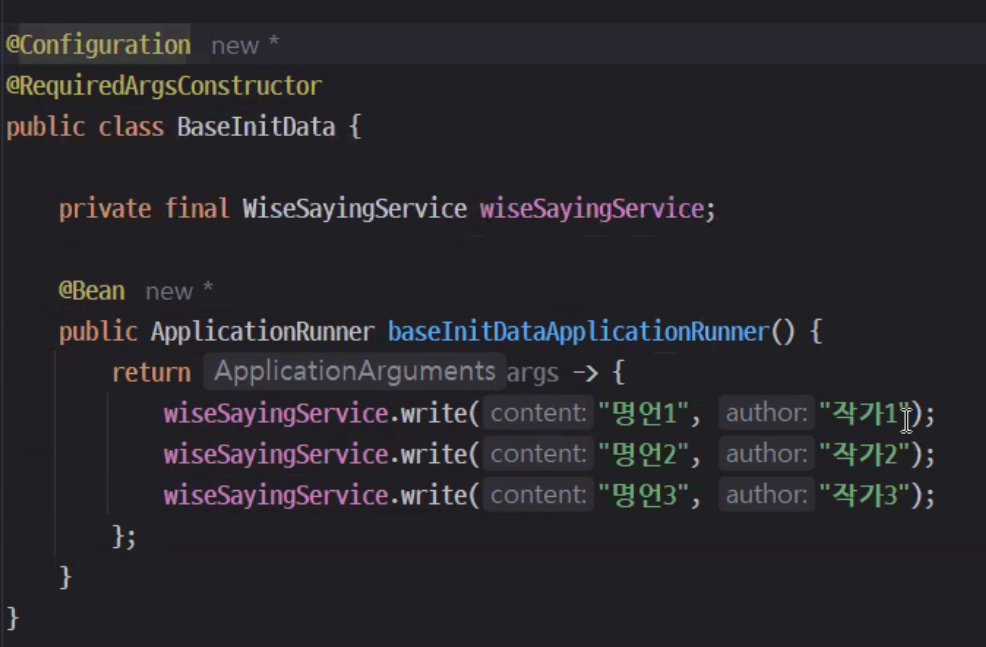

# application properties
`spring.jpa.hibernate.ddl-auto`의 규칙

우리는 `spring.jpa.hibernate.ddl-auto`를 `update`로 설정했다. 또 어떤 설정값이 있는지 간단히 알아보자.

- **none** : 엔티티가 변경되더라도 데이터베이스를 변경하지 않는다.
- **update** : 엔티티의 변경된 부분만 데이터베이스에 적용한다.
- **validate** : 엔티티와 테이블 간에 차이점이 있는지 검사만 한다.
- **create** : 스프링 부트 서버를 시작할 때 테이블을 모두 삭제한 후 다시 생성한다.
- **create-drop** : `create`와 동일하지만 스프링 부트 서버를 종료할 때에도 테이블을 모두 삭제한다.

개발 환경에서는 보통 `update` 모드를 사용하고, 운영 환경에서는 `none` 또는 `validate`를 주로 사용한다.

---

# 어노테이션 및 속성 설명

1. cascade = CascadeType.REMOVE
: 게시판 서비스에서는 질문 하나에 답변이 여러 개 작성될 수 있다. 그런데 보통 게시판 서비스에서는 질문을 삭제하면 그에 달린 답변들도 함께 삭제된다. 질문을 삭제하면 그에 달린 답변들도 모두 삭제되도록 cascade = CascadeType.REMOVE를 사용했다. https://www.baeldung.com/jpa-cascade-types을 참고!

2. @Autowired
: 객체를 주입하는 방식에는 @Autowired 애너테이션을 사용하는 것 외에 Setter 메서드 또는 생성자를 사용하는 방식이 있다. 순환 참조 문제와 같은 이유로 개발 시 @Autowired 보다는 생성자를 통한 객체 주입 방식을 권장한다. 하지만 테스트 코드의 경우 JUnit이 생성자를 통한 객체 주입을 지원하지 않으므로 테스트 코드 작성 시에만 @Autowired를 사용하고 실제 코드 작성 시에는 생성자를 통한 객체 주입 방식을 사용한다.

3. @Configuration
: 위 어노테이션이 붙어 있는 클래스 안의 메소드를 `빈`으로 사용하고 싶을 때 클래스에 붙이는 어노테이션. 빈으로 사용하고 싶은 메서드에는 @Bean 어노테이션을 붙여준다.

4. | 특성                  | @RequestParam                                         | @PathVariable                                    |
   |-----------------------|-------------------------------------------------------|-------------------------------------------------|
   | **데이터 위치**       | 쿼리 파라미터나 폼 데이터 (URL의 `?key=value`)         | URL 경로의 일부 (URI 템플릿 변수)               |
   | **사용 사례**         | 주로 `GET` 요청의 쿼리 파라미터 또는 `POST`의 폼 데이터 | RESTful API의 경로 매개변수                     |
   | **예시 URL**          | `/search?query=spring`                                | `/users/{id}`                                   |
   | **매핑 방법**         | 키-값 쌍으로 매핑                                    | 경로 템플릿 변수에 매핑                         |
   | **기본값 설정**       | 기본값(`defaultValue`) 지정 가능                      | 기본값 설정 불가능                              |
   | **필수 여부 설정**    | `required` 속성으로 필수 여부 지정 가능               | 항상 필수로 간주 (옵션 매핑 불가)               |
   | **HTTP 메서드와의 관계** | 모든 HTTP 메서드에서 사용 가능                       | 주로 RESTful 경로에서 사용                      |


```java 
@Configuration
public class HelloConfig {
    @Bean
    public Hello hello1() {
        return new Hello();
    }

    @Bean
    public Hello hello2(Hello hello1) {
        return new Hello();
    }
}
```

빈 이름
- @Component : 클래스 이름의 첫 글자를 소문자로 바꾼 이름으로 빈을 등록한다.
- @Bean : 메서드 이름을 빈 이름으로 사용한다. -> 위 예제에서는 hello() 메서드가 빈 이름이 된다.

🤔 빈 이름이 중복되면 어떻게 될까?

```java
@Configuration
public class HelloConfig {
    @Bean
    public Hello hello() {
        return new Hello();
    }

    @Bean
    @Primary
    public Hello hello() {
        return new Hello();
    }
}
```
- 해결 방법
  1. 빈 이름을 다르게 지정한다.
  2. @Bean(name = "hello1")과 같이 name 속성을 사용하여 빈 이름을 지정한다.
  3. @Primary 어노테이션을 사용하여 우선순위를 지정한다.
  4. @Qualifier 어노테이션을 사용하여 빈 이름을 지정한다.

```java
@Configuration
public class HelloConfig {

    @Bean("hello")
    public Hello hello1() {
        return new Hello();
    }

    @Bean("hello")
    public AnotherHello hello2() {
        return new AnotherHello();
    }
}

@Component
public class MyService {

    private final AnotherHello hello;

    @Autowired
    public MyService(@Qualifier("hello") AnotherHello hello) {
        this.hello = hello;
    }
}
```

4. 


---

# 파일 설명
- layout.html : html 을 표준형식으로 구현 및 변환하는 과정 중 중복되는 부분을 layout.html 로 분리하여 사용

---

# @OneToMany, @ManyToOne
`@ManyToOne` 하나만 사용했을 때와 `@OneToMany`와 함께 사용했을 때의 차이점은 **양방향 관계 정의 여부**, **데이터 접근 방식**, **JPA의 내부 처리 방식**에서 두드러집니다. 이를 구체적으로 설명하겠습니다.

---

## **1. `@ManyToOne` 하나만 사용했을 때**

### 특징
- **단방향 관계**:
    - 자식 엔티티(`Answer`)가 부모 엔티티(`Question`)를 참조하지만, 부모 엔티티는 자식 엔티티를 참조하지 않습니다.
    - `Answer`에서만 `Question` 정보를 접근할 수 있습니다.

### 장점
1. **간단한 구조**:
    - 관계가 단방향이므로 엔티티 설계와 데이터 처리가 간단합니다.
2. **효율적인 쿼리**:
    - 부모를 참조하는 외래 키만 저장되므로 데이터베이스 관점에서 조인 쿼리가 간단해집니다.

### 단점
1. **부모에서 자식 조회 불가**:
    - `Question` 엔티티를 통해 `Answer` 엔티티를 직접 조회할 수 없습니다.
    - 부모의 데이터를 기반으로 자식을 조회하려면 명시적으로 리포지토리를 사용해야 합니다.
      ```java
      List<Answer> answers = answerRepository.findByQuestionId(question.getId());
      ```
2. **부모-자식 관계의 관리 어려움**:
    - 자식 엔티티가 삭제되거나 수정되더라도 부모 엔티티에서 관리되지 않음.

### 예제 코드
#### `Answer` 엔티티
```java
@ManyToOne
private Question question; // 부모 엔티티 참조
```

#### `Question` 엔티티
- 부모 엔티티는 자식과의 관계를 명시적으로 정의하지 않음.

---

## **2. `@ManyToOne`과 `@OneToMany`를 함께 사용했을 때**

### 특징
- **양방향 관계**:
    - 부모 엔티티(`Question`)는 자식 엔티티(`Answer`)를 참조하고, 자식 엔티티도 부모 엔티티를 참조합니다.
    - 자식 리스트(`answerList`)가 부모 엔티티에 포함되어 있어 양방향으로 데이터에 접근할 수 있습니다.

### 장점
1. **부모에서 자식 조회 가능**:
    - `Question` 엔티티를 통해 관련된 모든 `Answer` 엔티티를 쉽게 조회할 수 있습니다.
      ```java
      List<Answer> answers = question.getAnswerList();
      ```
2. **자동 관계 관리**:
    - `cascade` 옵션을 사용하면 부모-자식 관계를 자동으로 관리할 수 있습니다. 예를 들어, 부모를 삭제하면 자식도 자동으로 삭제됩니다.
3. **더 직관적인 데이터 모델링**:
    - 질문(부모)과 답변(자식) 관계를 코드에서 더 명확히 표현할 수 있습니다.

### 단점
1. **구조 복잡도 증가**:
    - 양방향 관계로 인해 데이터베이스 조인 쿼리가 복잡해질 수 있습니다.
2. **잠재적 성능 문제**:
    - `@OneToMany` 필드는 데이터 조회 시 Lazy 로딩 기본값으로 인해 추가적인 쿼리가 발생할 수 있습니다.

### 예제 코드
#### `Question` 엔티티
```java
@OneToMany(mappedBy = "question", cascade = CascadeType.REMOVE, orphanRemoval = true)
private List<Answer> answerList; // 자식 엔티티 리스트
```

#### `Answer` 엔티티
```java
@ManyToOne
private Question question; // 부모 엔티티 참조
```

---

## **3. 차이점 요약**

| **항목**                    | **`@ManyToOne`만 사용**                                    | **`@ManyToOne` + `@OneToMany` 함께 사용**             |
|-----------------------------|-----------------------------------------------------------|------------------------------------------------------|
| **관계 방향성**              | 단방향 (자식 → 부모)                                       | 양방향 (부모 ↔ 자식)                                   |
| **부모에서 자식 접근**        | 직접 접근 불가능 (`Repository`를 통해 명시적으로 조회해야 함) | 부모 엔티티에서 자식 엔티티를 직접 조회 가능          |
| **자동 관계 관리**           | 불가능 (수동으로 삭제 및 관계 관리 필요)                   | 가능 (`cascade`, `orphanRemoval` 설정 사용 가능)       |
| **구현 복잡도**              | 간단함                                                    | 상대적으로 복잡                                       |
| **쿼리 효율성**              | 단순한 조인 쿼리                                          | 복잡한 조인 쿼리 발생 가능                            |
| **사용 사례**                | 자식 → 부모 참조만 필요한 간단한 관계                     | 부모 ↔ 자식 관계를 양방향으로 모두 다뤄야 하는 경우    |

---

### **4. 결론**
- **`@ManyToOne`만 사용**:
    - 부모에서 자식을 조회할 필요가 없고, 단순히 자식에서 부모를 참조하는 관계만 필요한 경우 적합합니다.
    - 구조가 간단하고 성능 상의 부담이 적습니다.

- **`@ManyToOne` + `@OneToMany` 함께 사용**:
    - 부모에서 자식을 조회하거나, 양방향으로 데이터 관리가 필요한 경우 적합합니다.
    - 관계의 자동 관리와 더 직관적인 코드 작성이 가능하지만, 구조와 성능 면에서 더 신경 써야 합니다.

당신의 프로젝트에서는 **질문(부모)과 답변(자식)** 간의 양방향 관계가 중요한 역할을 하므로, 현재처럼 `@ManyToOne`과 `@OneToMany`를 함께 사용하는 것이 적합한 선택입니다.

# 개선점
1.  AnswerService 의 create 메서드, QuestionService 의 create 메서드, UserService 의 create 메서드를 빌더 패턴으로 수정
    @Setter 대신 빌더 패턴 사용을 권장
2. Id, 날짜는 사용자가 수정할 필요 없다. @CreatedDate, @LastModifiedDate, @AccessLevel.PRIVATE 사용하여 수정
3. FK 설정하기 : Question, Answer, User 간의 관계 설정하기 (@ManyToOne, @OneToMany)
```java
public class Comment {
    @Id
    private int id;
    
    @ManyToOne
    @JoinColumn(name = "post_id") // FK 
    private Post post;
}
```
> (1:N) 관계에서는 N쪽에 FK를 두는 것이 맞다. (다른 관계)에서는 어디는 상관없다.

@OneToMany 같은 경우, FK가 N쪽에 생기므로 FK 생성이 불가하다. 그러므로 새로운 테이블을 만들어 FK를 생성해야 한다. 
그러나 @OneToMany(mappedBy = "question") 같은 경우, FK를 생성하지 않고, Question 테이블에 있는 question_id를 참조하여 이를 대체한다.

@OneToMany() : 양방향 객체 탐색, 필수 선언 아님, 기본 fetch 전략은 LAZY
@ManyToOne() : 단방향 객체 탐색, 관계를 맺으려면 필수 선언, 외래키, 기본 fetch 전략은 EAGER

4. @ManyToOne, @OneToMany 의 fetch 속성을 LAZY 로 설정하기

---

# Code Telling
## 기능 요구사항
- 기능1 : `질문 리스트` : 번호 / 제목 / 글쓴이 / 작성일시
  - 세부 기능 1 : 질문 등록 버튼
    - 세부 기능 1 :
      - (조건: 로그인 상태O) [등록] 버튼 클릭 시, 질문 등록 페이지로 이동
      - (조건: 로그인 상태X) [등록] 버튼 클릭 시, 로그인 페이지로 이동
  - 세부 기능 2 : 회원 가입 버튼
    - 세부 기능 1 : [회원 가입] 버튼 클릭 시, `회원 가입 페이지`로 이동 -> 필드 : 아이디 / 비밀번호 / 비밀번호 확인 / 이메일 -> 회원 가입 후 `질문 리스트 페이지`로 이동
  - 세부 기능 3 : 페이지 기능(이전, 0~N, 다음)
  - 세부 기능 4 : 제목 옆에 각 질문의 답변 개수 표기

- 기능2 : `질문 상세` 보기 - 각 질문 클릭하면 `상세 페이지`로 이동
    - 세부 기능 1 : 등록한 질문(제목, 내용) 확인 + 수정 + 삭제 :: [등록 일자 표기]
      - 세부 기능 1 : [질문-수정] 버튼 클릭 시, `질문 수정 페이지`로 이동 :: [수정 일자 표기] -> [저장하기] 버튼 클릭 시, `질문 상세 페이지`로 이동
      - 세부 기능 2 : [질문-삭제] 버튼 클릭 시, 질문 삭제
      - 세부 기능 3 : [답변 등록] 버튼 클릭 시, 답변 등록
        - 세부 기능 1 : [답변-수정] 버튼 클릭 시, `답변 수정 페이지`로 이동 -> [저장하기] 버튼 클릭 시, `질문 상세 페이지`로 이동
        - 세부 기능 2 : [답변-삭제] 버튼 클릭 시, 답변 삭제
        - 